# AWS EKS Infrastructure as Code
---
## Overview

This Terraform project provides a production-ready infrastructure setup for AWS EKS (Elastic Kubernetes Service) with all necessary supporting components. It follows infrastructure-as-code best practices and implements security, high availability, and scalability principles.

---

## Architecture

The infrastructure is organized into modular Terraform configurations:

```mermaid 
graph TB
    %% Definición de estilos de colores vibrantes
    classDef vpc fill:#0091EA,stroke:#01579B,stroke-width:2px,color:#fff;
    classDef iam fill:#9C27B0,stroke:#4A148C,stroke-width:2px,color:#fff;
    classDef security fill:#FF5252,stroke:#B71C1C,stroke-width:2px,color:#fff;
    classDef rds fill:#4CAF50,stroke:#1B5E20,stroke-width:2px,color:#fff;
    classDef eks fill:#FF9800,stroke:#E65100,stroke-width:2px,color:#fff;
    classDef outputs fill:#00BCD4,stroke:#006064,stroke-width:2px,color:#fff;
    classDef vars fill:#607D8B,stroke:#263238,stroke-width:2px,color:#fff;

    subgraph AWS_CLOUD ["☁️ INFRAESTRUCTURA AWS AS CODE (TERRAFORM)"]
        direction TB

        %% Módulo de Red
        subgraph MOD_VPC ["🌐 CAPA DE RED (VPC)"]
            direction TB
            VPC[("🏠 Main VPC<br/>10.0.0.0/16")]
            PubSub["☀️ Public Subnets<br/>(NAT + IGW)"]
            PrivSub["🔐 Private Subnets<br/>(Workloads)"]
            IGW["🌍 Internet Gateway"]
            NAT["⚡ NAT Gateway"]
            
            VPC --> IGW
            VPC --> PubSub
            VPC --> PrivSub
            PubSub --> NAT
            NAT -.-> PrivSub
        end

        %% Módulo de Seguridad
        subgraph MOD_SEC ["🛡️ CAPA DE SEGURIDAD"]
            direction LR
            SGR["🔒 Security Groups"]
            KMS["🔑 KMS Encryption"]
            Secrets["🕵️ Secrets Manager"]
        end

        %% Módulo IAM
        subgraph MOD_IAM ["🆔 IDENTIDAD Y ACCESOS (IAM)"]
            direction TB
            EKS_R["🏗️ Cluster Roles"]
            Node_R["🚜 Node Roles"]
            IRSA["🧬 IRSA (OIDC)"]
        end

        %% Módulo RDS
        subgraph MOD_RDS ["💾 BASE DE DATOS (RDS)"]
            direction TB
            RDSI["🛢️ RDS Postgres/MySQL"]
            DB_PG["⚙️ Parameter Group"]
            DB_SG["📡 DB Subnet Group"]
        end

        %% Módulo EKS
        subgraph MOD_EKS ["☸️ COMPUTE (EKS CLUSTER)"]
            direction TB
            EKS_C["🎮 Control Plane"]
            EKS_N["💻 Managed Node Groups"]
            EKS_A["🧩 EKS Add-ons"]
        end
    end

    %% Relaciones Lógicas de Flujo
    MOD_VPC ==> MOD_SEC
    MOD_IAM ==> MOD_EKS
    MOD_SEC ==> MOD_RDS
    MOD_VPC ==> MOD_EKS
    MOD_SEC ==> MOD_EKS
    
    %% Conexiones específicas de alto nivel
    PrivSub -.-> EKS_N
    PrivSub -.-> RDSI
    IRSA -.-> EKS_A

    %% Panel de Variables (Entradas)
    subgraph INPUTS ["📥 PARÁMETROS DE ENTRADA"]
        direction LR
        V1["🏷️ Project Tags"]
        V2["📏 CIDR Blocks"]
        V3["🚀 Instance Types"]
    end
    INPUTS ==> AWS_CLOUD

    %% Panel de Resultados (Salidas)
    subgraph OUTS ["📤 OUTPUTS RELEVANTES"]
        direction TB
        O1["🔗 EKS Endpoint"]
        O2["🔌 DB Connection String"]
        O3["🆔 IAM Role ARNs"]
    end
    MOD_EKS --> O1
    MOD_RDS --> O2
    MOD_IAM --> O3

    %% Aplicación de estilos
    class VPC,PubSub,PrivSub,IGW,NAT vpc;
    class EKS_R,Node_R,IRSA iam;
    class SGR,KMS,Secrets security;
    class RDSI,DB_PG,DB_SG rds;
    class EKS_C,EKS_N,EKS_A eks;
    class O1,O2,O3 outputs;
    class V1,V2,V3 vars;

```



---

### Core Modules

1. **VPC Module** - Multi-AZ network infrastructure with public/private subnets, NAT Gateways, and VPC Flow Logs
2. **IAM Module** - IAM roles and policies for EKS cluster, worker nodes, and IRSA (IAM Roles for Service Accounts)
3. **Security Module** - Security Groups and Network ACLs implementing defense-in-depth security
4. **RDS Module** - PostgreSQL Multi-AZ database with encryption, backups, and monitoring
5. **EKS Module** - Managed Kubernetes cluster with node groups, OIDC provider, and essential addons

---

### Key Features

- **High Availability**: Multi-AZ deployment across all components
- **Security**: KMS encryption, least-privilege IAM roles, security groups, IMDSv2 enforcement
- **Observability**: CloudWatch Logs, Metrics, and Alarms for all services
- **Secret Management**: AWS Secrets Manager with automatic rotation
- **Auto-scaling**: Cluster Autoscaler and configurable node group scaling
- **Infrastructure as Code**: Version-controlled, reproducible deployments

---

## Prerequisites

- AWS Account with appropriate permissions
- Terraform 1.6.0 or higher
- AWS CLI configured with credentials
- kubectl (for Kubernetes operations)

---

## Deployment

1. **Clone the repository**
   ```bash
   git clone <repository-url>
   cd <project-directory>
   ```

2. **Initialize Terraform**
   ```bash
   terraform init
   ```

3. **Review and customize variables**
   - Update `terraform.tfvars` with your configuration
   - Modify variables in each module as needed

4. **Plan the deployment**
   ```bash
   terraform plan -out=tfplan
   ```

5. **Apply the configuration**
   ```bash
   terraform apply tfplan
   ```
---

## Usage

### Accessing EKS Cluster
After deployment, configure kubectl:
```bash
aws eks update-kubeconfig --region <region> --name <cluster-name>
```

### Database Connection
Retrieve database credentials from Secrets Manager:
```bash
aws secretsmanager get-secret-value --secret-id <secret-arn>
```

### Monitoring
Access CloudWatch dashboards for:
- EKS cluster metrics
- RDS performance insights
- VPC Flow Logs
- Application Load Balancer metrics

## Module Variables

Each module accepts standardized variables:

| Variable | Description | Default |
|----------|-------------|---------|
| `project_name` | Prefix for all resources | Required |
| `tags` | Common tags for resources | `{}` |
| `environment` | Environment identifier | `production` |

## Outputs

Key outputs include:
- EKS cluster endpoint and OIDC provider ARN
- RDS connection endpoint and secret ARN
- VPC and subnet IDs
- IAM role ARNs for service accounts
- Security group IDs
- KMS key ARNs for encryption

---

## Security Considerations

- All data at rest is encrypted using AWS KMS
- IAM roles follow principle of least privilege
- Security groups restrict traffic to minimum required
- Secrets are managed via AWS Secrets Manager
- IMDSv2 is enforced on all EC2 instances

---

## Cost Estimation

The infrastructure includes:
- EKS cluster with 3 t3.medium nodes (on-demand)
- RDS PostgreSQL db.t3.medium Multi-AZ
- NAT Gateways (one per AZ)
- Standard CloudWatch Logs retention

Estimated monthly cost: ~$500-800 depending on region and usage.

---

## Future Enhancements

### Security Additions
- **Kyverno**: Kubernetes policy engine for enforcing security policies, validating resources, and mutating configurations
- **Falco**: Runtime security monitoring for Kubernetes
- **Kube-bench**: CIS benchmark compliance scanning
- **OPA/Gatekeeper**: Policy-based control for Kubernetes

### Observability
- **Prometheus/Grafana**: Advanced metrics collection and visualization
- **Loki**: Log aggregation system
- **Tempo**: Distributed tracing
- **OpenTelemetry**: Unified observability framework

### CI/CD Integration
- **ArgoCD**: GitOps continuous delivery
- **Tekton**: Cloud-native CI/CD pipelines

### Service Mesh
- **Linkerd**: Lightweight service mesh focused on simplicity and performance

-- Linkerd was chosen for its simplicity, performance, and low resource footprint. 
While Istio offers extensive features, Linkerd provides essential service mesh capabilities (automatic mTLS, traffic splitting, observability) with minimal operational overhead. 
Its lightweight proxy -~10MB vs Istio's 1.5GB- reduces infrastructure costs and simplifies troubleshooting.

### Storage Enhancements
- **EFS CSI Driver**: Persistent storage for shared filesystems
- **Rook/Ceph**: Cloud-native storage orchestration

### Backup and Disaster Recovery
- **Velero**: Kubernetes backup and migration tool
- **AWS Backup**: Centralized backup management

---

## Maintenance

### Updates
- Monitor AWS announcements for EKS and RDS version updates
- Regularly update Terraform providers and modules
- Review and rotate IAM credentials and KMS keys periodically

### Scaling
- Adjust node group sizes based on workload requirements
- Modify RDS instance class and storage as needed
- Review and update security groups as application requirements change

## Troubleshooting

Common issues and solutions:

1. **EKS nodes not joining cluster**: Check IAM role permissions and security group rules
2. **RDS connection failures**: Verify security group ingress rules and subnet connectivity
3. **Terraform state issues**: Use remote state backend (S3 + DynamoDB) for team collaboration

## License

This project is licensed under the MIT License - see the LICENSE file for details.

## Support

For issues and feature requests, please use the project's issue tracker.
